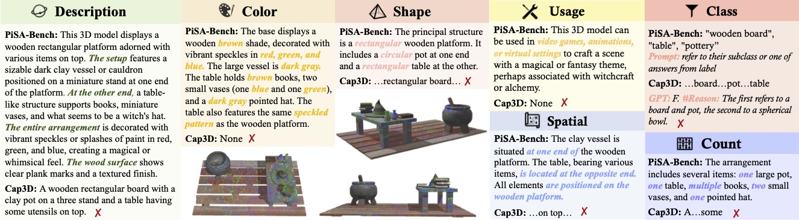

# 🌟🔥 [WACV 2026] PiSA: A Self-Augmented Data Engine and Training Strategy for 3D Understanding with Large Models

Official repository for the paper of "[PiSA: A Self-Augmented Data Engine and Training Strategy for 3D Understanding with Large Models](https://arxiv.org/pdf/2503.10529)".

[[📖 Paper](https://arxiv.org/pdf/2503.10529)]

## PiSA-Bench
We open-source the data of PiSA-Bench at [eval/PiSA_Bench.json](eval/PiSA_Bench.json).

<p align="center">
     <br>
</p>

### Evaluate
If you want to test on PiSA-Bench, please format your model output JSON file as follows:
```
{
    "prompt": "Caption this 3D model in detail.",
    "results": [
        {
            "object_id": "OBJECT_ID1_IN_PISA_BENCH",
            "ground_truth": "{\"description\": \"This 3D model displays a wooden rectangular platform adorned with various items on top. The setup features a sizable dark clay vessel or cauldron positioned on a miniature stand at one end of the platform. At the other end, a table-like structure supports books, miniature vases, and what seems to be a witch's hat. The entire arrangement is decorated with vibrant speckles or splashes of paint in red, green, and blue, creating a magical or whimsical feel. The wood surface shows clear plank marks and a textured finish.\", \"color\": \"The base displays a wooden brown shade, decorated with vibrant speckles in red, green, and blue. The large vessel is dark gray. The table holds brown books, two small vases (one blue and one green), and a dark gray pointed hat. The table also features the same speckled pattern as the wooden platform.\", \"shape\": \"The principal structure is a rectangular wooden platform. It includes a circular pot at one end and a rectangular table at the other.\", \"count\": \"The arrangement includes several items: one large pot, one table, multiple books, at least two small vases, and one pointed hat.\", \"spatial\": \"The clay vessel is situated at one end of the wooden platform. The table, bearing various items, is located at the opposite end. All elements are positioned on the wooden platform.\", \"usage\": \"This 3D model can be used in video games, animations, or virtual settings to craft a scene with a magical or fantasy theme, perhaps associated with witchcraft or alchemy.\"}", # dumped json string of description, color, shape, count, spatial, and usage of the object in PiSA_Bench.json
            "model_output": "YOUR_MODEL_OUTPUT"
        },
        {
            "object_id": "OBJECT_ID2_IN_PISA_BENCH",
            "ground_truth": "{\"description\": \"This 3D model depicts a contemporary, streamlined desktop PC case. It features a black, boxy shape with defined edges. The front panel is equipped with a slot for a DVD drive marked 'DVD' and possibly another slot beneath it. On one side, there are three blue designs resembling claws or lightning bolts. The opposite side includes a sizeable round mesh section for air flow, with '8KEN' inscribed in blue, likely signifying a brand or model. The back panel has typical computer case ventilation openings for air circulation and hardware connections. The case boasts a matte finish, rendering it appropriate and attractive for office or gaming environments.\", \"color\": \"The primary color is black, complemented by blue highlights such as the claw-like patterns on one side and the '8KEN' inscription on the other.\", \"shape\": \"The case is shaped as a rectangular prism or cuboid with crisp edges. It narrows slightly at the front, enhancing its sleek look. The back panel is designed with standard ventilation holes.\", \"count\": \"There is one PC case.\", \"spatial\": \"\", \"usage\": \"This 3D model is suitable for use in various digital settings including simulations of computer setups, designs for gaming spaces, promotional content for custom-built PCs, or educational materials concerning computer components.\"}",
            "model_output": "YOUR_MODEL_OUTPUT"
        },
        ...
    ]
}
```
## Cite
Please cite us if you find our work helpful!
```
@article{guo2025pisa,
  title={Pisa: A self-augmented data engine and training strategy for 3d understanding with large models},
  author={Guo, Zilu and Lin, Hongbin and Yuan, Zhihao and Zheng, Chaoda and Qiu, Pengshuo and Jiang, Dongzhi and Zhang, Renrui and Feng, Chun-Mei and Li, Zhen},
  journal={arXiv preprint arXiv:2503.10529},
  year={2025}
}
```
